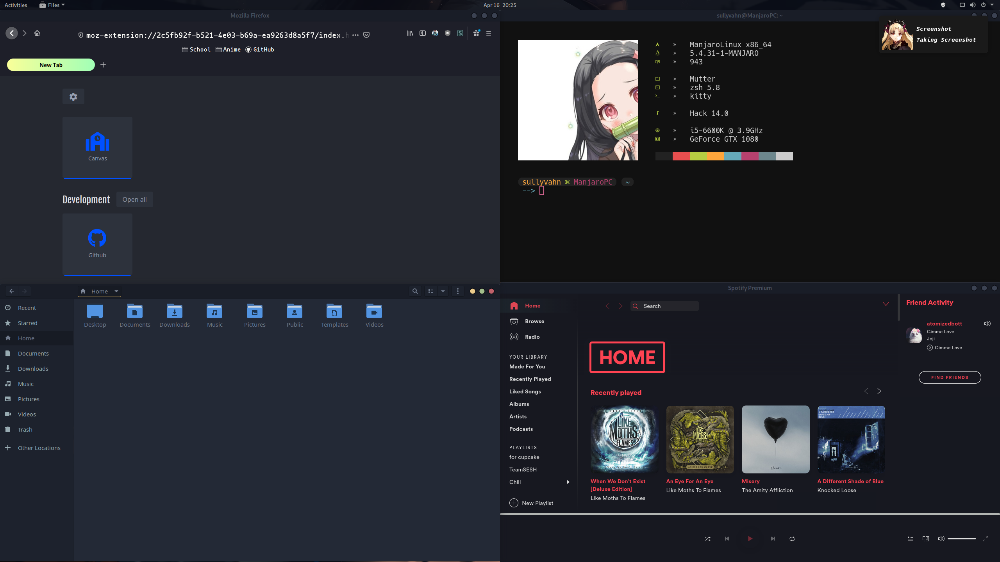
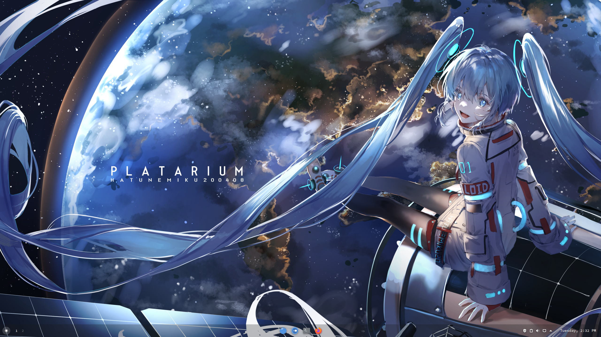
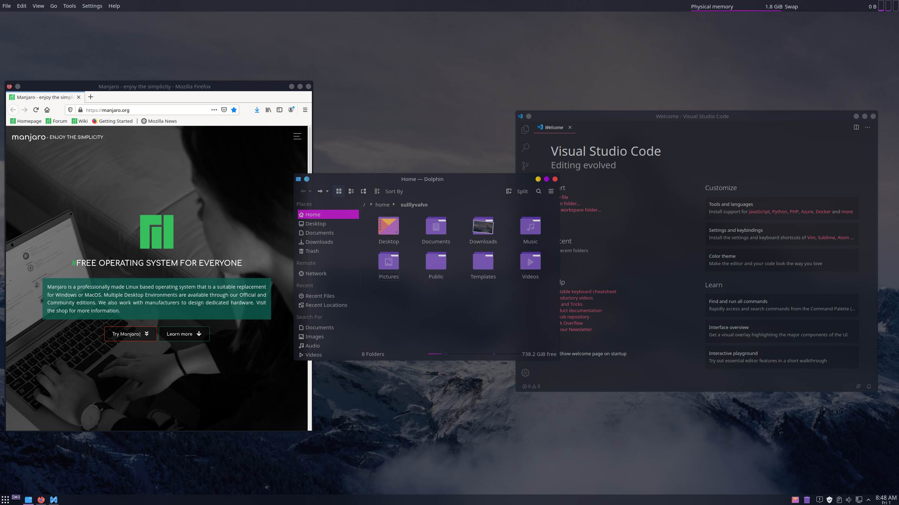
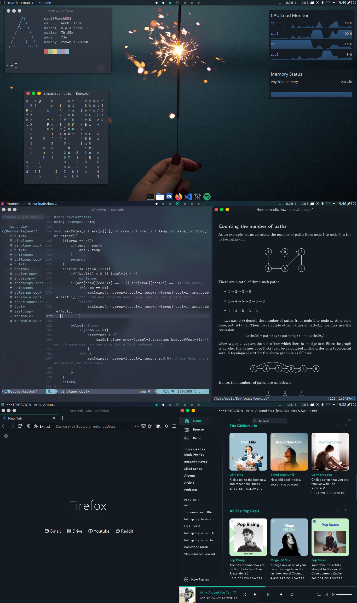

# Apps
    - Firefox
    - VScode
    - Neofetch

# Fonts
    - Nerd Fonts Complete Package

# Gnome:First

### Info
- GTK Theme
    - Juno
- Icons
    - Papirus
- Fonts Installed
    - Nerds Font Complete Package
- Firefox
    - https://github.com/mut-ex/minimal-functional-fox
    - https://github.com/Brettm12345/github-moonlight
    - nightTab Extension
- Spotify
    - https://github.com/khanhas/spicetify-cli
        - Material-Ocean Theme
- neofetch
- kitty
- dunst
- oh-my-zsh
    - https://github.com/hohmannr/bubblified

# KDE: Chrome-OS

### Info
- Global Theme: Qogir-Dark
    - Install from settings

- Plasma Theme: Chrome-OS
    - Install from aur
    
- Application Style:
    - GNOME/GTK Application
        - GTK2 Theme: Breeze
            - Install from aur
        - GTK3 Theme: Qogir-dark
            - Install from aur

- Window Decorations: hello
    - Install from aur
    
- Colors: Qogir-Dark
    
- Icons: Tela
    - Install from aur
    
- Cursor: Capitane Cursors White
    - Install from aur

- Latte Dock
    - Install from aur
    
- Widgets
    -Latte Spacer
    - Latte Separator
    - Event Calendar    
    - Virtual Desktop Bar
        - Install from aur

- TO-DO
    - Terminal
    - Dolphin

# KDE: Sweet

### Info
- Icons: Flatery-Dark
    - Install from aur
- Plasma Theme: Sweet
    - Install from settings
- Application Style: Kvantum-Dark
- Window Decorations: Sweet Dark Transparent
    - Install from settings
- Colors: Sweet
    -Install from settings
- Kwin Scripts:
    - Force Blur
- Window Rules:
    - Transparent
    - Transparent Exceptions
- Widgets
    - Global Menu Panel

# KDE: Aritim-Dark

### Info
- Global Theme
    - Aritim-Dark
    - System Settings
- Color Scheme
    - Aritim-Dark
    - System Settings
- Konsole Color Scheme
    - Material Ocean
    - Dotfiles
- Spicetify
    - Night
    - Dotfiles
- Window Decorations
    - Sierra Breeze
    - Turn off title bar seperator in theme setting
    - Aur
- Icons
    - Flat Remix
- ToDo
    - Work on latte dock
    - Top Panel
    - Dolphin Customization