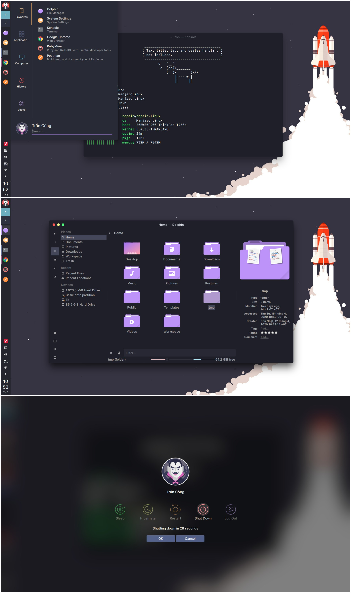
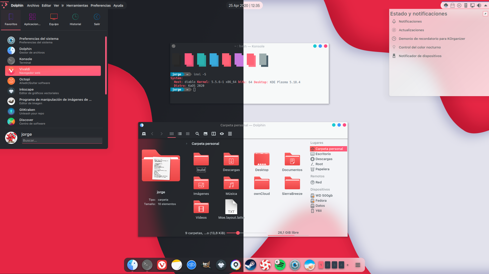

# Apps
    - Firefox
    - VScode
    - Neofetch
    - Konsole
    - Kitty

# Firefox
- https://github.com/mut-ex/minimal-functional-fox
- https://github.com/Brettm12345/github-moonlight
- nightTab Extension

# Fonts
    - Nerd Fonts Complete Package
    - San Francisco Pro

# Gnome:First


### Info
- GTK Theme
    - Juno
- Icons
    - Papirus
- Spotify
    - https://github.com/khanhas/spicetify-cli
        - Material-Ocean Theme
- neofetch
- kitty
- dunst
- oh-my-zsh
    - https://github.com/hohmannr/bubblified

# KDE: Chrome-OS


### Info
- Global Theme: Qogir-Dark
    - Install from settings

- Plasma Theme: Chrome-OS
    - Install from aur
    
- Application Style:
    - GNOME/GTK Application
        - GTK2 Theme: Breeze
            - Install from aur
        - GTK3 Theme: Qogir-dark
            - Install from aur

- Window Decorations: hello
    - Install from aur
    
- Colors: Qogir-Dark
    
- Icons: Tela
    - Install from aur
    
- Cursor: Capitane Cursors White
    - Install from aur

- Latte Dock
    - Install from aur
    
- Widgets
    -Latte Spacer
    - Latte Separator
    - Event Calendar    
    - Virtual Desktop Bar
        - Install from aur

- TO-DO
    - Terminal
    - Dolphin

# KDE: Sweet


### Info
- Icons: Flatery-Dark
    - Install from aur
- Plasma Theme: Sweet
    - Install from settings
- Application Style: Kvantum-Dark
- Window Decorations: Sweet Dark Transparent
    - Install from settings
- Colors: Sweet
    -Install from settings
- Kwin Scripts:
    - Force Blur
- Window Rules:
    - Transparent
    - Transparent Exceptions
- Widgets
    - Global Menu Panel

# KDE: Aritim-Dark


### Info
- Global Theme
    - Aritim-Dark
    - System Settings
- Color Scheme
    - Aritim-Dark
    - System Settings
- Konsole Color Scheme
    - Material Ocean
    - Dotfiles
- Spicetify
    - Night
    - Dotfiles
- Window Decorations
    - Sierra Breeze
    - Turn off title bar seperator in theme setting
    - Aur
- Icons
    - Flat Remix
- ToDo
    - Work on latte dock
    - Top Panel
    - Dolphin Customization

# KDE: Dracula



## Installation
1. Install [hello decoration](https://github.com/n4n0GH/hello)

    Buttons color scheme: 
    - close: `#ff5555`
    - minimize: `#f1fa8c`
    - maximize: `#50fa7b`

    Settings:
    - Turn off titlebar gradient

2. Install Yet-another-dracula theme
    ```bash
    $ git clone https://github.com/nopain2110/Yet-another-dracula.git
    ``` 
    - Copy `color-schemes` to `~/.local/share/color-schemes` and activate by go to `Settings → Colors → Yet-another-dracula`
    - Copy `Kvantum` to `~/.config/Kvantum` and activate by go to `Settings → Application Style → kvantum`, open Kvantum Manager and select `Yet-another-dracula`
    - Copy `plasma` to `~/.local/share/plasma` and activate by go to `Settings → Plasma Style → Yet-another-dracula`
    - Copy `sddm` to `~/.local/share/sddm` and activate by go to `Settings → Startup and Shutdown → Login Screen (SDDM) → Dracula`

3. Others
    - Install vinceliuice's [Tela icon theme](https://github.com/vinceliuice/Tela-icon-theme) with purple dark variant and patch colors with my script [dracula-tela-icon-patch.sh](https://github.com/nopain2110/Yet-another-dracula/blob/master/Yet-another-dracula/dracula-tela-icon-patch.sh) for a more consistent and beautiful experience.
    - Icons: SF Pro

# KDE:Moe



- Plasma Theme: Moe-Dark
- Application Style: Kvantum - MoeDark
- GTK
    - GTK2: Breeze Dark
    - GTK3: Breeze Dark
- Window Decorations: [Sierra Breeze](https://github.com/jomada/SierraBreeze)
    - Turn off seperator title bar
    - Window specefic dolphin no borders
- Colors: Moe Dark
- Icons: McMuse-Circle-Red